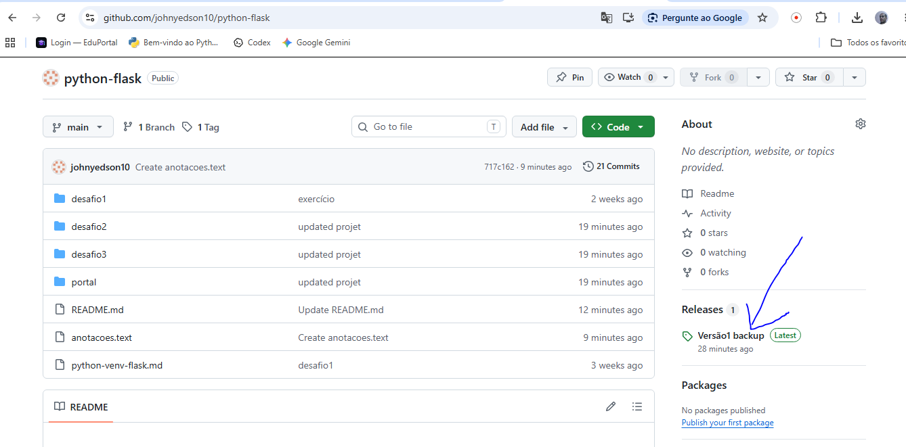

# Hello

## Backup

### para sincronizar dados do repositório para o computador
 ```
git pull
 ```

### abrir o explorar de arquivo usando o botão direito do mouse
- Revel in File Explorer

### Clonar um repo
- git clone xxx

### entrar na pasta do projeto
- cd nome-do-projeto

### abrir com vscode
- code .

### Backup usando Releases do Github




### Tipos de backup
- [x] Github
- [ ] CSV
- [ ] Json
- [ ] Dump

### Projetos mobile Nativo PWA e Responsivo

- PWA
- Nativo
- Responsivo

## Restaurar

## Suporte